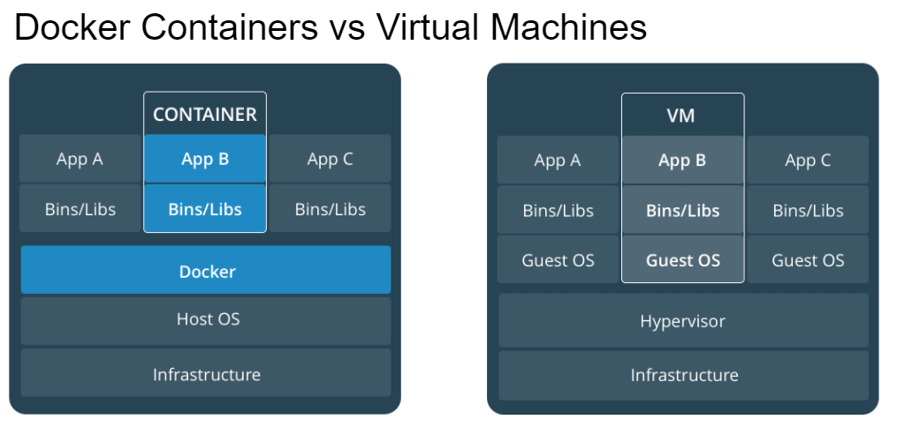
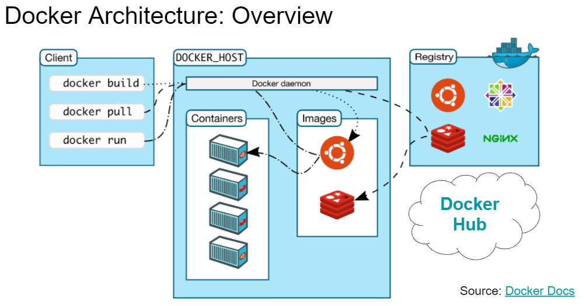
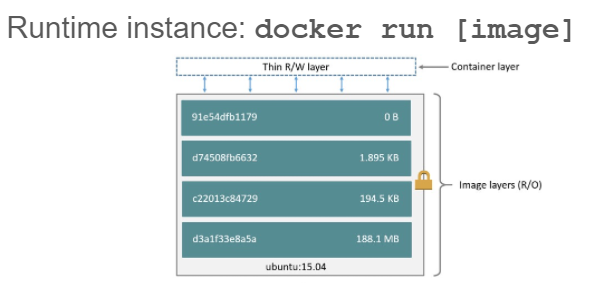
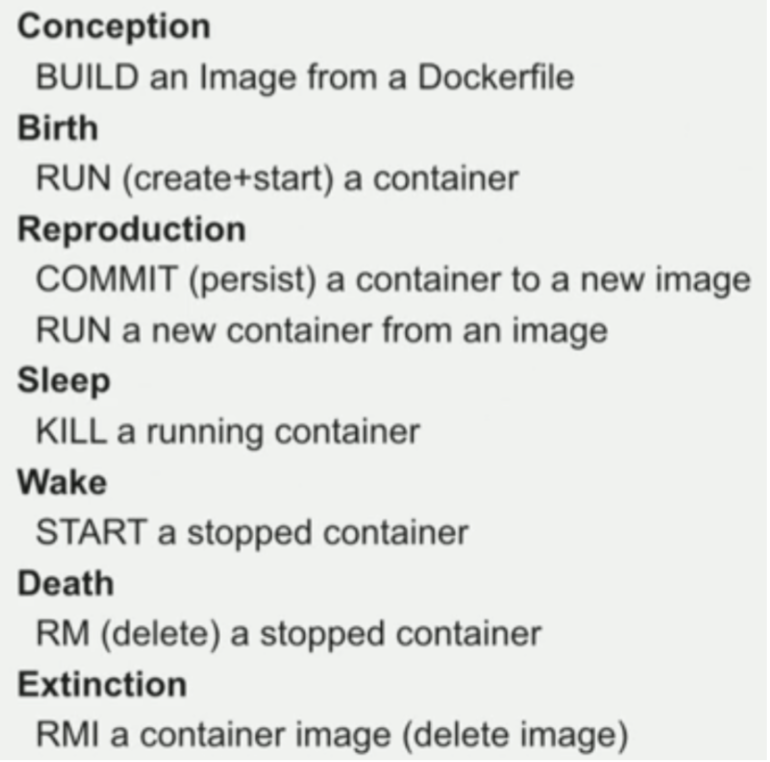
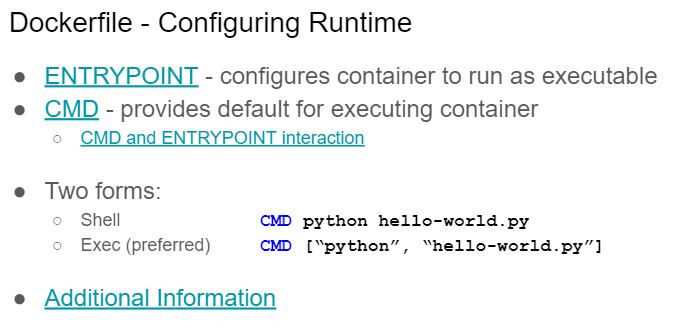
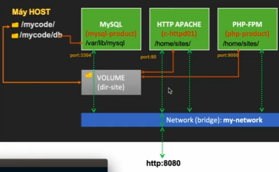
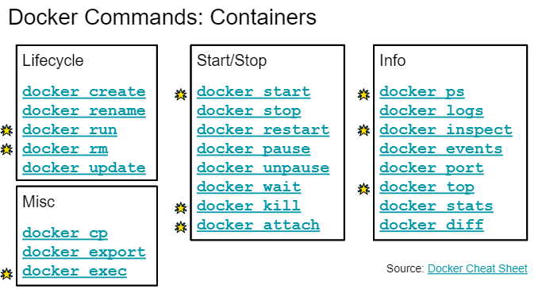
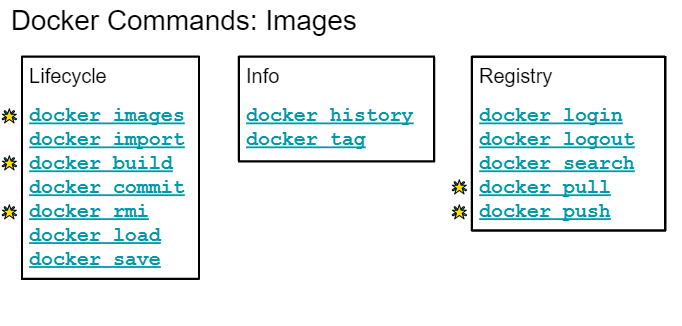

ps aux | grep mysql
sudo lsof -i :3306
sudo lsof -i -P -n | grep LISTEN

## Principles

### Compare

Docker is a platform to package and run application in isolated environments called containers

-   containers run natively on the host machine’s kernel -> a lot more lightweight & better performance characteristics

-   In the VM model, there is a hypervisor which provides each VM with virtual access to the host’s resources

### Overview

-   Docker Daemon: manages Docker objects like containers and images, listens to requests from the Docker client
-   Docker Host (which can be either local or remote) which is running the Docker daemon
-   Docker Hub is a public registry

-   Docker Image: frozen snapshot of a container, consists of a set of read only layers. Each layer is ONLY the set of differences from the layer before it

-   Docker container: When we create a container, we add a thin read/write layer on top of the image layer stack

-   Dockerfile: use to create image.
    -   ENTRYPOINT which configures a container, got the name from Docker Hub
    -   CMD is default for the executing container, each command creates a new layer
    -   Run: docker build -t hello:0.0.1 .
    -   Best Practices
        -   Be explicit about build process
        -   Containers should be stateless
        -   Use .dockerignore file
        -   Avoid installing unnecessary packages
        -   Clean cache after installation
        -   Each container should have only one concern / purpose
        -   Minimize the number of layers
        -   Multi-line arguments, sort alphabetically
        -   CMD should be used to run processes inside container
        -   Advanced users should use it in conjunction with ENTRYPOINT
        -   MAINTAINER is deprecated; use LABEL

## DOCKER

docker ps

docker ps -a

### IMAGE

Docker search “image”

Docker pull “”image”:”version”

Docker images rm id

Docker image history id

### CONTAINER

Docker run -it imageid —name “name”

docker run -dp 3000:3000 ‘name’

docker rm ‘id’

Docker start id

-   -d Detached (runs in background)
-   -a Attach to STDOUT/STDERR
-   -i Interactive (keeps STDIN open)
-   -t Allocates pseudo-TTY
-   --name [NAME] Set the container name

docker stop id

Docker attach Id

Docker exec containerid command

Docker rm -f container_id

Docker diff container_id

### CONTAINER—> IMAGE

Docker commit id name:version (when container exited status)

Docker save —output file.tar id_images

Docker load -I ile.tar

Docker tag f nameimage:version

Docker run -it -v path/in/local path/in/docker id

Docker run -it --name “name2” —volumes-from id id_image

### PERSIST

docker volume ls

docker volumn create todo-db

docker run -dp 3000:3000 -v todo-db:/etc/todos “container”
—> save database

docker volumn rm “”name”

docker volume inspect “name”

### TO UPDATE CODE

docker run -dp 3000:3000 -w /app -v "$(pwd):/app" node:12-alpine sh -c "yarn install && yarn run dev"

—> then build to create image:
docker build -t getting-started .
\\ getting-started is name-tag

### MULTI-CONTAINER:

docker network ls

docker network inspect bridge (watch containers)

docker network create --driver mynetwork

docker network rm mynetwork

docker run -it --network mynetwork -p 8888:80 imageid

### Compose

docker-compose up

docker run -d \
 --network todo-app --network-alias mysql \
 -v todo-mysql-data:/var/lib/mysql \
 -e MYSQL_ROOT_PASSWORD=secret \
 -e MYSQL_DATABASE=todos \
 mysql:5.7

docker run -dp 3000:3000 \
 -w /app -v "$(pwd):/app" \
 --network todo-app \
 -e MYSQL_HOST=mysql \
 -e MYSQL_USER=root \
 -e MYSQL_PASSWORD=secret \
 -e MYSQL_DB=todos \
 node:12-alpine \
 sh -c "yarn install && yarn run dev"

-   [Source1](https://www.youtube.com/watch?v=jbb1dbFaovg), [Source2](https://youtube.com/playlist?list=PLwJr0JSP7i8At14UIC-JR4r73G4hQ1CXO)
-   [Use vscode extension](https://www.youtube.com/watch?v=sUZxIWDUicA)

-   [Slide](https://docs.google.com/presentation/d/11y8C-5u35_7--IUPuI4i4Xqiy-FUcR1GAERdJg692c8/edit#slide=id.g3950aa8d3c_0_220)

-   [Cheatsheet](https://github.com/wsargent/docker-cheat-sheet)

