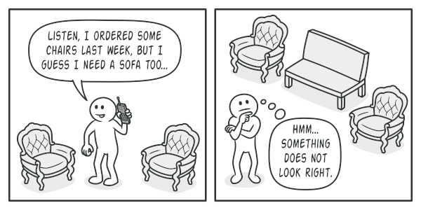

## Define
Lets you produce families of related objects without specifying their concrete classes.

## Problem

Also, you don’t want to change existing code when adding new products or families of products to the program. Furniture vendors update their catalogs very often, and you wouldn’t want to change the core code each time it happens.

## Structure

